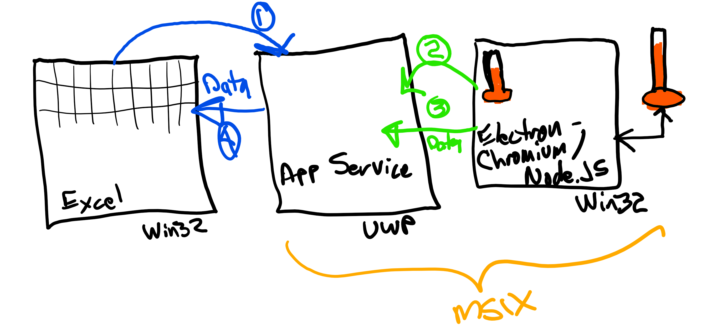
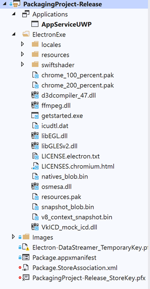
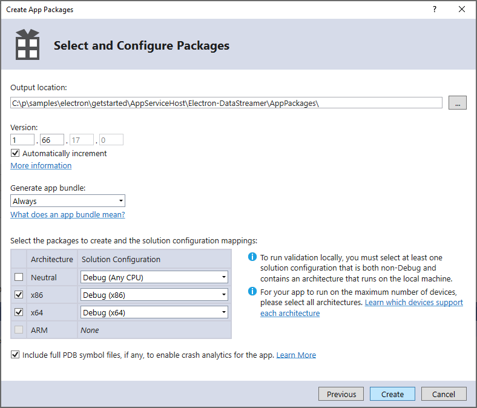

# Electron App - Excel Data Streamer Sample

 Excel’s Data Streamer  [Excel Data Streamer](https://support.office.com/en-us/article/What-is-Data-Streamer-1d52ffce-261c-4d7b-8017-89e8ee2b806f) add-in supports capturing, visualizing, and analyzing real-time sensor data in Excel.   

The Excel Data Streamer does this using the [App Service](https://docs.microsoft.com/en-us/windows/uwp/launch-resume/app-services) feature of Windows 10. 

This sample demonstrates how you can connect your Electron app with the Excel Data Streamer.

This sample will use several features of the Windows 10 platform including:  
* App Service  
* The bundling of a Win32 app (Electron app) and UWP app (App Service) is the same MSIX package.  
* Extended Capabilities:  
  * runFullTrust  
  * extendedBackgroundTaskTime

This sample will use several Electron / Node.JS  features including:
* Calling native Windows Runtime APIs from JavaScript  
* Conversion of an Electron app into a standalone Win32 app.  

# Architecture



The Excel Data Streamer uses the Windows 10 App Service infrastructure to send and receive data from a data source. Excel enumerates all app services with the name ```com.microsoft.datastreamerconnect```. This is how the **'Connect to a device'** list is built in the Data Streamer.  

The data source exposes an app service to which Excel connects. (Step 1)  
The data source, in this case the Win32 Electron app, also connects to the app service. (Step 2)  
The data source then sends data to the App Service. (Step 3)  
The App Service then relays the data to the Data Streamer via the connection saved in Step 1. (Step 4)  
The App Service (UWP) and Data Source (Win32 Electron app) are packaged and deployed in the same MSIX package.

# What's in the Sample
The sample includes the following:
* An Electron app 
* The Electron app will call native WinRT APIs via JavaScript using the NodeRT libraries.
* The app converted to a Win32 app.
* The Win32 app packaged in an MSIX file for distribution.
* THe MSIX package includes:
1. The Win32 Electron App
2. A separate UWP App Service process that works with the Electron App.
3. The AppxManifest.xml configured for the App Service / Win32 app connection.

You will need the latest version of Office 365 installed to use the Data Streamer supported by this sample. Version 1904 or greater.

# Setup
## Environment 
* Windows 10 17134 or greater
* Chocolatey package installer
* node.js npm - Node Package Manager
* Python 2.7.16
* Visual Studio 2015 Build Tools
* Visual Studio 2019 Community Edition
* Electron framework cli
* Electron Builder cli
* NodeRT libraries

### Install Tools
* Clone this repo and run ```starthere.cmd``` from a Windows admin command prompt. This will install all of the tools and build the native NodeRT libraries and Electron Win32 app.
* Note for details on the installed tools, see the batch file ```installtools.cmd```.
<!--   

### Install Chocolatey
* https://chocolatey.org/install

### Install node.js and npm, python 2.7, Visual Studio tools
* choco install vscode
* choco install nodejs  
* choco install python2  
* choco install vcbuildtools  
* choco install visualstudio2019community  
* Start Visual Studio Installer and install the workloads:  
1. .NET Desktop Development  
2. Desktop Development with C++. 
3. Universal Windows Platform Development 
4. Install Windows 17134 SDK -->

<!-- * Copy platform.winmd:  
  ```copy "c:\Program Files (x86)\Microsoft Visual Studio\2017\BuildTools\VC\Tools\MSVC\14.16.27023\lib\x86\store\references\platform.winmd" "C:\Windows\Microsoft.NET\Framework64\v4.0.30319\"```   
* Copy Windows.winmd:  
  ```copy "C:\Program Files (x86)\Windows Kits\10\UnionMetadata\10.0.17763.0\windows.winmd" "C:\Program Files (x86)\Windows Kits\10\UnionMetadata"``` -->
<!-- 5. Clone this repo
6. Change to directory: Samples\Electron\Getstarted\Electron

* npm install --global windows-build-tools -->

## Install Electron and build the NodeRT libraries
Note: This is done as part of the ```installtools.cmd``` batch file. See 'Install Tools' above. Included here in case you want to do this separately.

Start in directory: samples\electron\getstarted\Electron  

```npm install --save-dev electron```  

Note: The NodeRT native Windows libraries will build using the VC build tools.  
Reference: https://github.com/electron/electron/blob/master/docs/tutorial/first-app.md  

## Install Electron-Builder to create Win32 app
Note: This is done as part of the ```installtools.cmd``` batch file. See 'Install Tools' above. Included here in case you want to do this separately.

Start in directory: samples\electron\getstarted\Electron  

```npm install electron-builder```   
Reference: https://www.electron.build/cli  

# Build the Electron app targeting Windows
Note: This is done as part of the ```installtools.cmd``` batch file. See 'Install Tools' above. Included here in case you want to do this separately.

Start in directory: samples\electron\getstarted\Electron  
```.\node_modules\\.bin\electron-builder -w```

# Sample Components 
## Open and build the AppServiceHost.sln solution in Visual Studio 2019
This solution contains four projects:  
1. **AppServiceHost** - UWP App Service implemented here.
2. **MyElectronApp** - WinForms placeholder app. This is necessary in order to work with the Packaging Project. We will overwrite it's contents with the Electron Win32 EXE.
3. **Packaging Project-Debug** - Packaging Project that contains App Service, Electron App and Manifest. The apps appearance and exposing of the app service is defined here. This runs Electron in debug mode and also allows for the debugging of the app service. 
4. **Packaging Project-Release** - Packaging Project that contains App Service, Electron App and Manifest. The apps appearance and exposing of the app service is defined here. This runs the Win32 version of the Electron app.   

# Run the sample (Debug)
1. Press F5 to build and run the sample. The Build targets should be for x86, Debug. The StartUp project should be **Packaging Project-Debug**. This will deploy the app and register the App Service.
2. Connect to the Excel Data Streamer:
   a. Click on the Data Steamer Tab  
   b. Click on **Connect to Device**  
   c. Click on **Packaging Project-Debug**  
   d. Click on **Start Data**  
   e. Switch focus to Electron App  
   f. Click on **Connect to App Service**  
   ```Note: In text box, you should see: OpenAsync: 0 ```  
   0 indicates no error 
   g. Click on **Setup Data Connection**  
   ```Note: In text box, you should see: sendMessageAsync: 0 ```  
   h. Click on **Write Data**
   i. Switch focus back to Excel
   ```Note: You should see data sent to Excel ```  
3. You can use the debug tools in Electron to debug your JavaScript and step through the calls to the App Service.

## Run the sample (Release)
Note that this will package the app built with Electron Builder.
1. Press F5 to build and run the sample. The Build targets should be for x86, Release. The StartUp project should be **Packaging Project-Release**. This will deploy the app and register the App Service.
2. Connect to the Excel Data Streamer:
   a. Click on the Data Steamer Tab  
   b. Click on **Connect to Device**  
   c. Click on **Packaging Project-Release**  
   d. Click on **Start Data**  
   e. Switch focus to Electron App  
   f. Click on **Connect to App Service**  
   ```Note: In text box, you should see: OpenAsync: 0 ```  
   0 indicates no error 
   g. Click on **Setup Data Connection**  
   ```Note: In text box, you should see: sendMessageAsync: 0 ```  
   h. Click on **Write Data**  
   i. Switch focus back to Excel
   ```Note: You should see data sent to Excel ```  

## App Packaging

Using a 'Windows App Packaging Project' we package the App Service and the Electron app together. It includes the necessary edits to Package.appxmanifest to support the app service registration and launching of the electron client. You can create packages for sideloading or uploading to the Store.

Is is what the ```<Applications>``` section looks like:

```xml
  <Applications>
    <Application Id="App"
      Executable="AppServiceUWP.exe"
      EntryPoint="App">
      <uap:VisualElements
        AppListEntry="none"
        DisplayName="Electron Data Streamer - Release"
        Description="Electron- Data Streamer Client"
        BackgroundColor="transparent"
        Square150x150Logo="Images\Square150x150Logo.png"
        Square44x44Logo="Images\Square44x44Logo.png">
        <uap:DefaultTile Wide310x150Logo="Images\Wide310x150Logo.png"  Square71x71Logo="Images\SmallTile.png" Square310x310Logo="Images\LargeTile.png"/>
        <uap:SplashScreen Image="Images\SplashScreen.png" />
      </uap:VisualElements>
      <Extensions>
        <uap:Extension Category="windows.appService">
          <uap:AppService Name="com.microsoft.datastreamerconnect"/>
        </uap:Extension>
      </Extensions>
    </Application>
    <Application Id="FTApp"
      Executable="ElectronExe\getstarted.exe"
      EntryPoint="Windows.FullTrustApplication">
      <uap:VisualElements
        DisplayName="Electron Data Streamer - Release"
        Description="Electron- Data Streamer Client"
        BackgroundColor="transparent"
        Square150x150Logo="Images\Square150x150Logo.png"
        Square44x44Logo="Images\Square44x44Logo.png">
        <uap:DefaultTile Wide310x150Logo="Images\Wide310x150Logo.png"  Square71x71Logo="Images\SmallTile.png" Square310x310Logo="Images\LargeTile.png"/>
        <uap:SplashScreen Image="Images\SplashScreen.png" />
      </uap:VisualElements>
    </Application>
```
Note there are two applications listed here. The first is our App Service (AppServiceUWP.exe). The second is our Electron app (ElectronExe\getstarted.exe). 

 Note the line
```xml
AppListEntry="none"
```
This will prevent the App Service from being added the the **Start** menu. Having the app in the Start menu is not needed since the app service is never started by the user.

## Including the Electron App
The electron app is included in the Packaging Project via linked files to the output files of ``Electron-Builder``. Electron-Builder writes it's output to the folder: ```dist\win-unpacked```. In Visual Studio, I created the folder ```ElectronExe``` and copied the files (and subfolders) from  ```dist\win-unpacked``` to this folder as **links**. Links are important, it allows the files to change and update as subsequent builds are done.  



## Package.appxmanifest file:

You will need to include the following Restricted Capabilities in the Package.appxmanifest file:

```xml
xmlns:rescap=http://schemas.microsoft.com/appx/manifest/foundation/windows10/restrictedcapabilities
. . . 
IgnorableNamespaces="uap mp rescap build">

  <Capabilities>
. . . 
    <rescap:Capability Name="runFullTrust" />
    <rescap:Capability Name="extendedBackgroundTaskTime" />
  </Capabilities>
```

You will need to edit the XML directly: Highlight the file in Solution explorer,  press F7 to edit the file directly.

## App Submission
As these capabilities are restricted, you will need to provide justification in your application’s submission in Partner Center:

Note: No justification is required for the runFullTrust capability.

In the ‘Submission Options’, in answer to the following question:  
**Why do you need the extendedBackgroundTaskTime capability, and how will it be used in your product?**

You can use the following text:  
```This restricted capability (extendedBackgroundTaskTime) is needed due to the architecture of the Excel Data Streamer and how it interfaces with our UWP app service. Because Excel is a Win32 app, app services that it connects to are given only 30 seconds to run. The workaround for this scenario is to include the extendedBackgroundTaskTime capability in the app manifest. This removes to 30 second run-time restriction allowing our solution to run as expected.```

# Application Sideloading

Sideloading is useful to provide a side-loadable package to testers and others to provide you feedback on your app.  

Create packages in Visual Studio:  
1. Right click the **Packaging Project-Release** project.
2. Select Store | Create App Packages | I want to create packages for sideloading.
3.  Check only **x86** and **x64** architectures.  Suggested defaults below:
  

Note: If installed on Windows 10 Pro or Home, these SKUs of Windows have the Sideloading setting enabled. (This is required if installing apps outside of the Store.) If installed on Windows 10 Enterprise, the device must have Sideloading enabled. (It’s disabled by default.)  Details [here](https://docs.microsoft.com/en-us/windows/application-management/sideload-apps-in-windows-10).

You can sideload the app by first installing the test certificate, following these steps:
1. Right-click on the .appxbundle or .appx package and select **properties**.
2. Under the **Digital Signatures** tab you should see the test certificate. Click to select the certificate and click on Details button.
3. Select the button **View Certificate**.
4. Select the button **Install Certificate**.
5. From the **Store Location** radio buttons select **Local Machine**. Click the **Next** button.
6. Click **Yes** on the admin prompt for changes to your device.
7. On the **Certificate Import Wizard** chose the radio button **Place all certificates in the following store** then select the **Browse** button.
8. Select the **Trusted People** certificate store. Then click the **OK** button.
9. Click the **Next** button on the **Certificate Import Wizard** window.
10. Click **Finish** button to complete the certificate install.
    
 After installing the certificate, you can double click on the the .appx/.mspx or .appxbundle/.msixbundle to launch [App Installer](https://www.microsoft.com/store/apps/9nblggh4nns1) and install the app.
